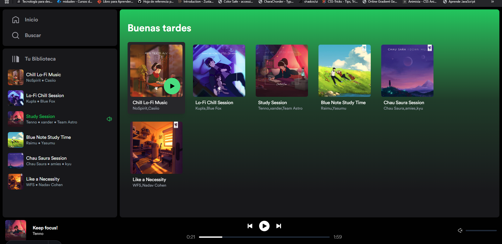
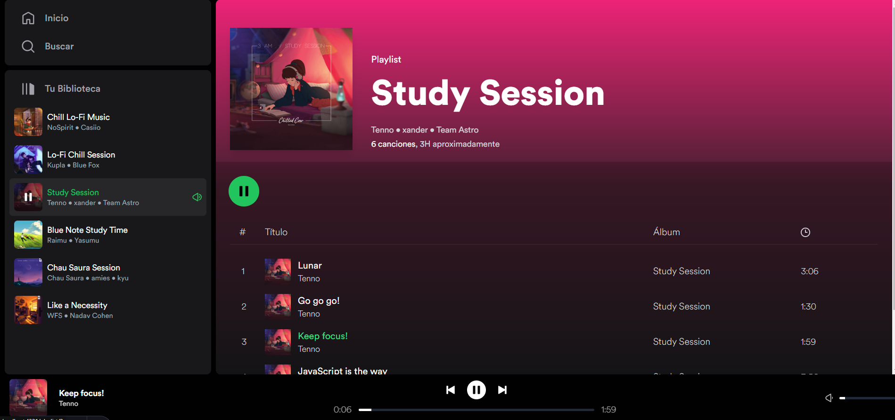

# Spotify Clone (Astro v5)

Un clon funcional de la interfaz de Spotify construido con **Astro v5**, integrando **React**, **TypeScript**, y **Zustand** para el manejo del estado global. Este proyecto emula funcionalidades básicas de la plataforma de streaming musical, con un diseño interactivo.

## 🚀 **Características**

- 🎵 Reproductor interactivo con opciones de pausa y reproducción.
- 📂 Listas de reproducción dinámicas obtenidas de datos simulados.
- 📜 Navegación entre secciones como Álbumes y Playlists.
- 💾 Persistencia de datos en memoria utilizando Zustand.
- 🖥️ Diseño responsive y estilizado con TailwindCSS.

---

## 📸 **Capturas de pantalla**

### Página Principal

### Vista de Playlist

---

## 🛠️ **Tecnologías Usadas**

- **Astro v5**: Framework de desarrollo web ultrarrápido.
- **React**: Manejo de componentes interactivos.
- **TypeScript**: Tipado estático para mayor seguridad y legibilidad.
- **Zustand**: Gestión de estado simple y eficiente.
- **TailwindCSS**: Framework CSS para diseño moderno y responsive.

---

## ⚙️ **Requisitos Previos**

Asegúrate de tener instalado lo siguiente:

- [Node.js](https://nodejs.org/) (v18 o superior)
